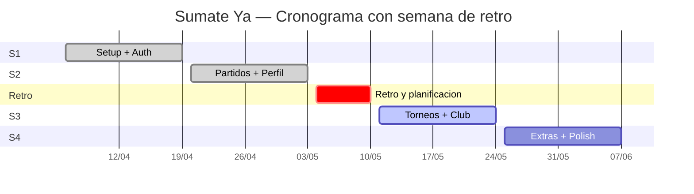

# Retrospectiva de Sprint — Sumate Ya

> **Equipo:** mateo-khalil · michelcap · Chuecks · franzerbi · Pipe-UM · **Tablero:** [`summate-ya kanban`](https://github.com/users/mateo-khalil/projects/2) · **Período revisado:** 06/04 → 03/05 (Sprints 1 y 2) · **Fecha:** 11/05/2026

## Resumen del período

Cerramos los dos primeros sprints en plazo y al 100% del alcance comprometido. Entre el cierre del Sprint 2 y el arranque del Sprint 3 hicimos una **pausa de una semana de retro** para revisar lo aprendido, ajustar el tablero y planificar la fase de torneos — esta retrospectiva recoge lo que vimos en esa semana, ya con cinco días del Sprint 3 corridos para contrastar.

| Sprint | Fechas | Cards | Estimación | Done | PRs | Resultado |
|:---|:---:|:---:|:---:|:---:|:---:|:---:|
| **S1** — Setup + Auth | 06/04 → 19/04 | 11 | 26 pts | 11 (100%) | 10 | Cerrado en plazo |
| **S2** — Partidos + Perfil | 20/04 → 03/05 | 13 | 39 pts | 13 (100%) | 29 | Cerrado en plazo |
| *Semana de retro* | 04/05 → 10/05 | — | — | — | — | Planificación de S3 |
| **S3** — Torneos + Club *(en curso)* | 11/05 → 24/05 | 18 | 41 pts | 4 (22%) | 18 | En riesgo |

## Cómo se ve el tablero a mitad del Sprint 3

```mermaid
flowchart LR
    subgraph Backlog["Backlog · 7"]
        B1[Listado torneos]
        B2[Detalle torneo]
        B3[Unirse a torneo]
        B4[Cambiar contrasena]
        B5[Ranking]
        B6[Privacidad]
        B7[Confirmar resultado]
    end
    subgraph RFT["Ready for test · 7"]
        R1[Crear torneo]
        R2[Crear partido club]
        R3[Panel de club]
        R4[UX SLOT]
        R5[UX Crear Partido]
        R6[Calendario]
        R7[Responsivo]
    end
    subgraph Done["Done · 4"]
        D1[Bloquear horarios]
        D2[Mejoras e2e]
        D3[Unify sidebar]
        D4[Fix slot]
    end
    Backlog --> RFT --> Done
    style Backlog fill:#fff4e1,stroke:#d97706
    style RFT fill:#e0f2fe,stroke:#0284c7
    style Done fill:#dcfce7,stroke:#16a34a
```

Tenemos 7 cards atascadas en *Ready for test* y otras 7 sin arrancar, faltando seis días para el cierre. Si no se desbloquean antes, el grueso del testing va a caer otra vez sobre el fin de semana.

## Cómo se repartió el trabajo

| Integrante | S1 (cards/pts) | S2 (cards/pts) | S3 (cards/pts) | PRs e2e con Playwright |
|:---|:---:|:---:|:---:|:---|
| mateo-khalil | 7 / 12 | soporte | soporte | 2 — Page Objects, accesibilidad |
| michelcap | 4 / 11 | 10 / 35 | 9 / 15 | — |
| Chuecks | 3 / 8 | 2 / 4 | 4 / 18 | 2 — foto perfil, mapa |
| franzerbi | — | foco testing | 1 / 3 | 5 — login, registro club, listado, historial, abandonar |
| Pipe-UM | — | foco testing | 2 / 5 | 5 — registro jugador, detalle, crear, filtrar, perfil |

El conteo de cards de feature por persona no termina de contar la historia completa. Chuecks viene desarrollando desde el S1 (registro, listado de partidos, home, torneos en el S3) y además sumó un par de tests e2e (foto de perfil, mapa). Por el lado de **franzerbi y Pipe-UM**, que se sumaron al equipo a partir del S2, el foco inicial fue meterse a aprender Playwright y armar desde cero la cobertura e2e del proyecto — page objects, fixtures, builders y storage state que hoy cubren login, registro, listado, detalle, crear, filtrar partidos, perfil y mapa. Es trabajo que no aparece como card de feature pero quedó como base sólida para los próximos sprints.

## Lo que está funcionando y queremos mantener

**Milestones con fechas explícitas y ventana de 2 semanas.** Cerramos S1 y S2 al 100% en parte porque el alcance estaba acotado y la fecha era innegociable.

**Issues bien armados.** User Story, subtareas, criterios de aceptación y notas técnicas. Más la trazabilidad `PR ↔ Card ↔ Epic` que dan las etiquetas de dominio y `Linked pull requests` — desde el tablero se entiende el progreso sin abrir cada PR.

**El flujo `In progress → Ready for test → Testing → Done` con `Tester` asignado.** Separar QA del desarrollo y dejar constancia de quién valida cada card resultó útil, sobre todo cuando varias cards llegan a testing en simultáneo.

**Invertir en e2e en paralelo al desarrollo.** El esfuerzo de Playwright que arrancó en el S2 ya empezó a pagarse: hoy tenemos una red mínima contra regresiones y el equipo entero domina la stack.

**Ajustar el tablero después de cada retro.** Tras el S1 sumamos el campo `Size` (XS-S-M-L-XL) y `Estimate` para que la complejidad de cada tarea fuera visible para todos. Funciona — desde el S2 entran cargados y ya nadie discute "cuán grande es una card" a ojo. Mantener la costumbre de meter un cambio concreto al tablero al cierre de cada retro.

## Lo que vamos a corregir en el próximo sprint

Cada mejora trae el cambio que vamos a hacer, cómo lo vamos a implementar y cómo vamos a saber si funcionó.

#### 1. Cards listas para testear, como muy tarde, el viernes

Veníamos arrastrando que el testing se concentre el domingo a último momento. En el S3 ya tenemos 7 cards apiladas en *Ready for test* a seis días del cierre. El acuerdo es simple: **toda card tiene que estar en *Ready for test* antes del viernes de la semana 2**. Para el S4 eso es el viernes 05/06. Sábado y domingo quedan para testear y arreglar lo que aparezca, no para sumar features.

Lo vamos a implementar seteando `Target date = viernes semana 2` por defecto al planificar cada card. Si alguien ve que no llega, lo dice el viernes a la mañana y la card se reduce de scope o se mueve al sprint siguiente, sin sorpresas el domingo. Al cierre contamos cuántas cards llegaron tarde — la meta es **una como máximo**.

#### 2. Repartir mejor la carga entre todos

Mirando S2 y S3, las cards de feature quedaron concentradas en pocas manos. En el S2 fue principalmente porque franzerbi y Pipe-UM estaban arrancando con Playwright; en el S3, aunque la carga está más repartida en cantidad de cards, el avance real sigue desbalanceado — varias cards grandes asignadas no llegaron todavía a *Done*. Ahora que el equipo entero maneja la stack de testing, conviene rebalancear y, sobre todo, asegurarse de que las cards asignadas avanzan.

En el próximo planning vamos a fijar un **tope de 40% de la estimación por persona** y un **piso de 15% para cada integrante activo**, con el compromiso de que todos toman al menos una card de feature además de cualquier tarea de testing. La verificación es directa: al cierre del sprint sumamos los puntos por persona y revisamos que nadie quedó arriba del 40% ni abajo del 15%.

#### 3. Un check obligatorio a mitad del sprint

En el S3 hay cards con cero avance a mitad del sprint, sin registro escrito de bloqueos ni de reasignaciones. La idea es agregar una **reunión sincrónica de 15 minutos los miércoles de la semana 2**, donde cada uno cuenta en qué card está, qué lo traba y si llega al viernes. Si una card no arrancó, se reasigna ese mismo día.

Queda como evento recurrente en el calendario y dejamos rastro escrito en los comentarios de la card. Al cierre del sprint la meta es que **ninguna card haya quedado en *Backlog*** sin haberse tocado.

#### 4. Que ninguna card entre al sprint sin estimar

En el S3 entraron bugs y mejoras de UX sin `Size` ni `Estimate`. Suma trabajo invisible al sprint y desencaja el conteo de puntos. **Regla nueva: una card no se mueve a una milestone de sprint sin `Priority`, `Size` y `Estimate` cargados** — y los bugs que aparezcan a mitad de sprint se estiman antes de tomarse, no después.

Para verificarlo dejamos un filtro guardado en el tablero (`milestone = Sprint actual AND (size is empty OR estimate is empty)`) que revisamos en cada mid-sprint check. La meta es que ese filtro quede **vacío al cierre del sprint**.

## Cierre

Los dos primeros sprints mostraron que el equipo puede comprometerse y entregar el 100% cuando la carga está balanceada y el alcance está claro. El S3, mediado en el momento de esta retro, pone sobre la mesa dos cosas a corregir antes del S4: el testing apilado al final del sprint y la distribución todavía desbalanceada de cards de feature. Las cuatro mejoras de arriba apuntan ahí y, lo más importante, traen una forma concreta de verificar si funcionaron.
